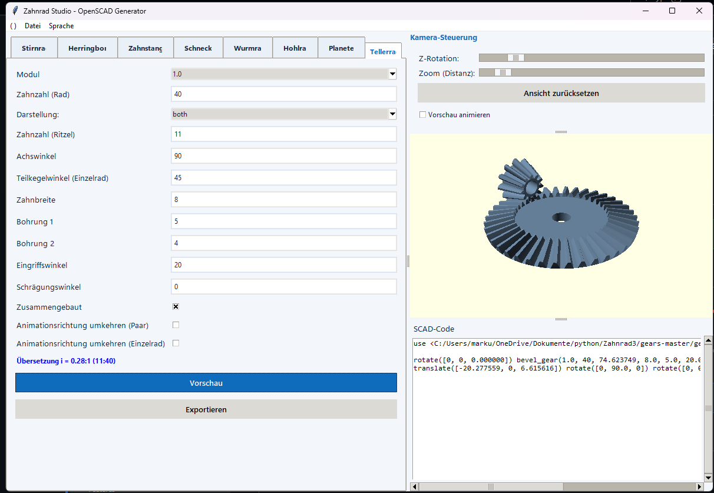
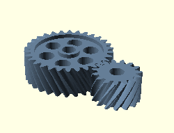
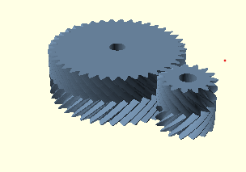
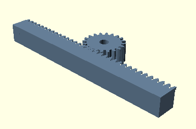
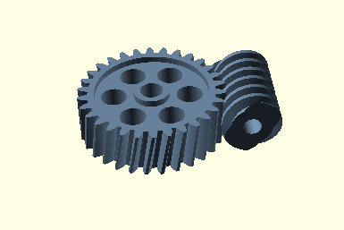
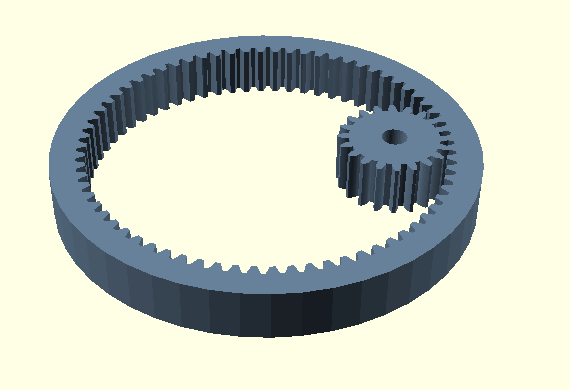
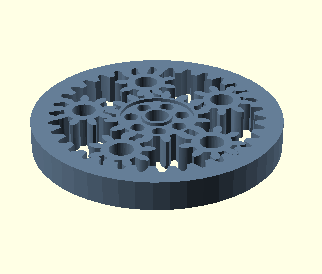
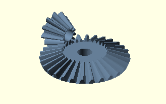

# Zahnrad Studio

Zahnrad Studio ist eine lokale Python-Anwendung zur parametrischen Erzeugung von Zahnradern und Getriebekomponenten fuer OpenSCAD. Das Projekt richtet sich an Maker, Entwickler und Konstrukteure, die Zahnradgeometrien schnell konfigurieren, pruefen und als OpenSCAD-Modelle weiterverwenden moechten.

## Projektbeschreibung

Zahnrad Studio bietet eine Desktop-Oberflaeche fuer die schnelle Erstellung technischer Zahnradmodelle. Geometrien werden aus Eingabewerten wie Modul, Zahnzahl, Bohrung, Breite, Profilverschiebung und Eingriffswinkel berechnet und als OpenSCAD-Code ausgegeben.

Die Anwendung kombiniert eine Tkinter-Oberflaeche mit Berechnungslogik fuer verschiedene Getriebearten. Dadurch lassen sich Varianten schnell vergleichen, visuell pruefen und fuer Prototyping, 3D-Druck oder weitere OpenSCAD-Workflows vorbereiten.

## Funktionsumfang

- Erzeugung von Stirnraedern, Herringbone-Raedern, Zahnstangen, Schnecken, Wurmraedern, Innenzahnraedern, Planetengetrieben und Tellerradpaaren
- Parametrische Eingabe fuer Geometrie, Bohrungen, Winkel, Breiten und Montagevarianten
- Integrierte Vorschau mit Kamera-Steuerung
- Export der Modelle fuer OpenSCAD und Weitergabe an eine lokale OpenSCAD-Installation
- Mehrsprachige Oberflaeche ueber [lang.ini](lang.ini)

## Technik

- Python-Anwendung mit Tkinter-Oberflaeche
- Berechnungslogik in [gear_math.py](gear_math.py)
- Hauptanwendung in [gear.py](gear.py)
- Tests in [tests](tests)
- OpenSCAD-Bibliotheken ueber [gears-master](gears-master) und [BOSL2-master](BOSL2-master)

## Anwendung

## Beispielbilder

### Stirnradpaar

### Herringbone

### Zahnstange

### Wurmrad

### Innenzahnrad

### Planetengetriebe

### Tellerrad

## Voraussetzungen

- Python 3.10 oder neuer
- OpenSCAD fuer Vorschau, Export und das direkte Oeffnen erzeugter Modelle
- Eine Python-Umgebung mit verfuegbarem Tkinter

## Start

Die Anwendung laesst sich lokal mit `python gear.py` starten. Fuer Vorschau, Export und das direkte Oeffnen der Modelle sollte OpenSCAD installiert und erreichbar sein.

Alternativ steht im Ordner `dist/` eine vorkompilierte `gear.exe` bereit, die ohne Python-Installation direkt gestartet werden kann. Die EXE wird mit PyInstaller ueber `make_exe.bat` erzeugt.

## Entwicklung

Fuer die Codepflege sind in [requirements-dev.txt](requirements-dev.txt) Werkzeuge wie Black und Ruff hinterlegt. Mit [smoke_test.py](smoke_test.py) sowie den Tests in [tests](tests) stehen zudem einfache Pruefpfade fuer Berechnungen und Regressionen bereit.